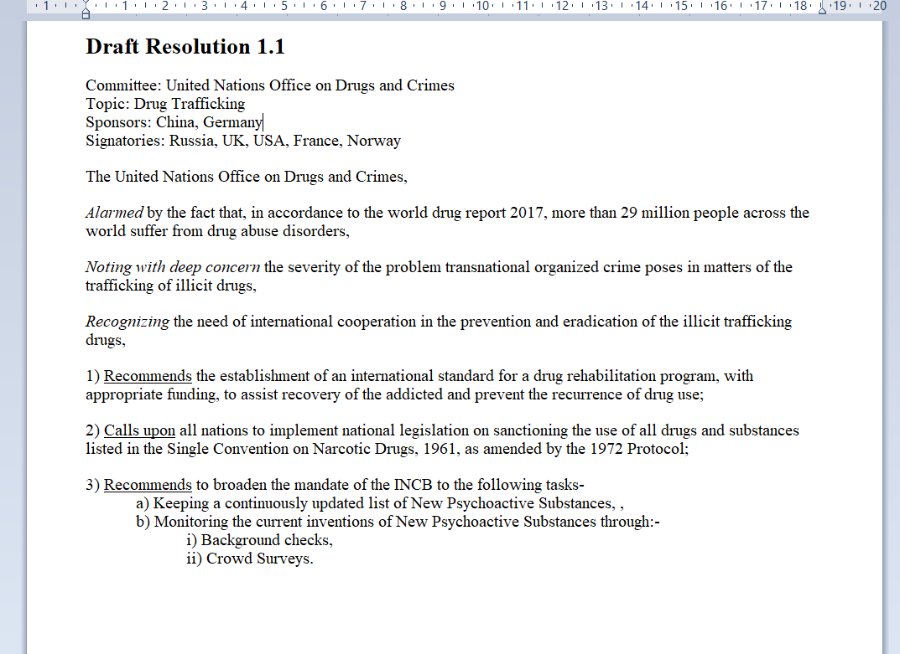

# MUN Resolution Writer
This is an open-source tool to make drafting resolutions in MUN committees far easier. It is a python-based desktop application made with PyQt5 and python-docx library. It takes in raw text data and generates a .docx file which is fully formatted and ready to submit. I made this tool because I have personal experience of my entire resolution being scrapped due to formatting errors XD. You can check out the main.py file for the source code, or simply run the standalone exe file to use this app. __Please see the below instructions on how to use:__

* First enter in the title of you resolution, your committee and the topic ... this should be pretty straight-forward.
* Enter the sponsor and signatory nations, separated by a comma and a space. Do not add a comma or a semi-colon at the end of the line. __Do not separate into multiple lines.__
* Enter the preambulatory clauses __One per line__ and separated by a comma. There needs to be atleast 1 preambulatory clause and each clause needs to contain atleast 2 words.
* Operative clauses:
  * Enter the operative clauses __One per line__ and separated by a semicolon, or comma, depending on the situation. There needs to be atleast one operative clause and each operative clause needs to have atleast 2 words. 
  * If the clause is a sub-clause to a previous clause, add in a single space before it.
  * If it is a sub-sub-clause to a previous sub-clause, add in two spaces before it.
* Select the required formatting for the keywords for both preambs and operatives.

### Output of the above example:

